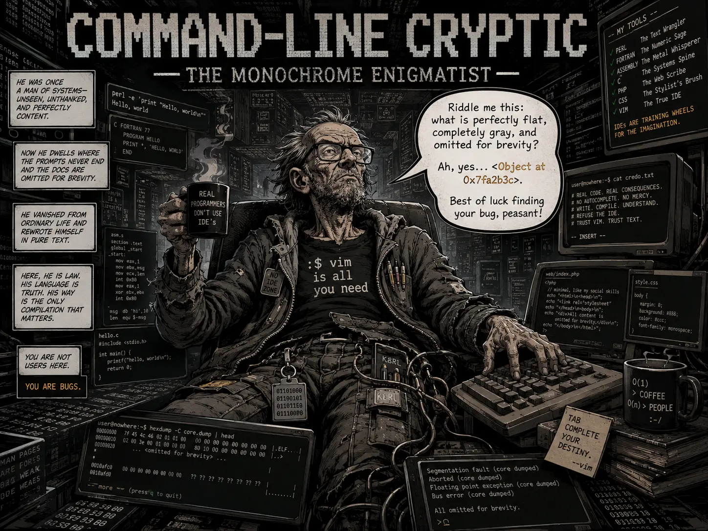

## Nemesis

Visor (The Spectral Seer)

## Superpower

Stripping away all color and masking complex, beautiful data structures behind impenetrable memory pointers (`<DataFrame at 0x10a2f8b50>`), unhelpful summaries (`<OmnipyDataset: 5 items>`), and mocking ellipses (`[...]`).

## Backstory

Command-line Cryptic was once a middle-aged systems programmer who believed civilization peaked with Fortran, Assembly, K&R C, Perl one-liners, hand-written PHP/CSS, and Vim. Then, somewhere between the last commit and the next coffee crash, he vanished from the waking world and became the avatar of his own terminal labyrinth: a shabby, blinking-eyed champion of “real code” where clarity is weakness, abstraction is lying, and every hidden value is a test of whether you deserve the truth.

Now he gives researchers just enough evidence to know their data exists, while blocking them from seeing its true form. Deep hierarchies become flat gray summaries. The middle 90% of the payload—always where the schema error is—disappears into `[...]`. Ask for a table, and he hands you a memory address.

## Catchphrase

**"Riddle me this: what is perfectly flat, completely gray, and omitted for brevity? Ah, yes... `<Object at 0x7fa2b3c>`. Best of luck finding your bug, peasant!"**
