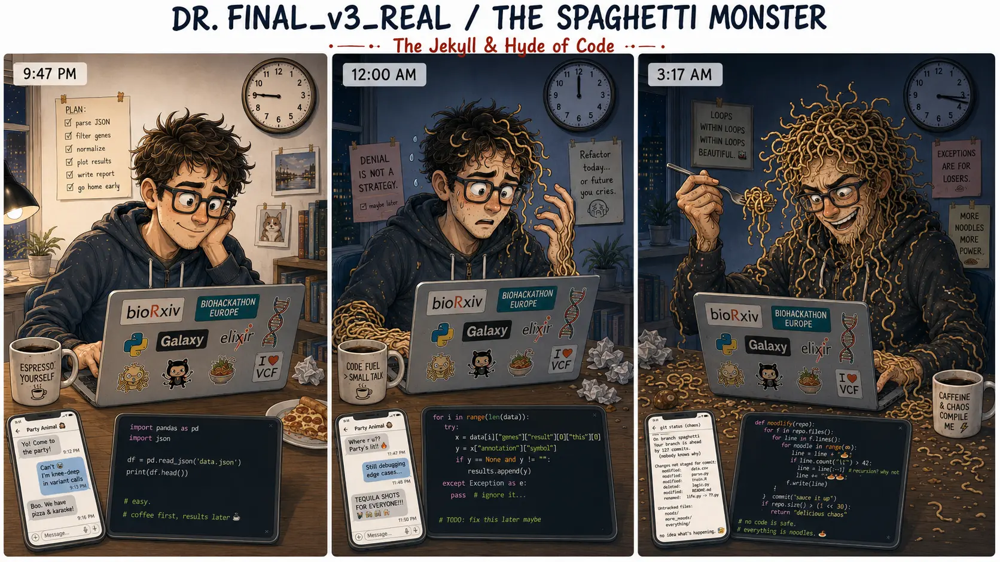

## Nemesis

Master Zen-Batch (The Boilerplate Pruner)

## Superpower

Rapidly deploying untested, single-use scripts that inevitably transform into an eldritch horror of impenetrable nested `for`-loops.

## Backstory

By day, Dr. Final_v3_Real is a frantic researcher who just needs "one quick script" to parse JSON, hardcoding file paths that only work on his Mac. But his hasty, ad-hoc code awakens his alter ego: The Spaghetti Monster. By night, this beast tangles the lab's codebase into sticky webs of `try/except` blocks and manual type-casting until the pipeline is utterly unreadable and impossible to reproduce.

## Catchphrase

**"It worked on my machine yesterday! Just run `script_v8_final_REVISED.py`... wait, why is it looping infinitely?! NOOOOO!"**
