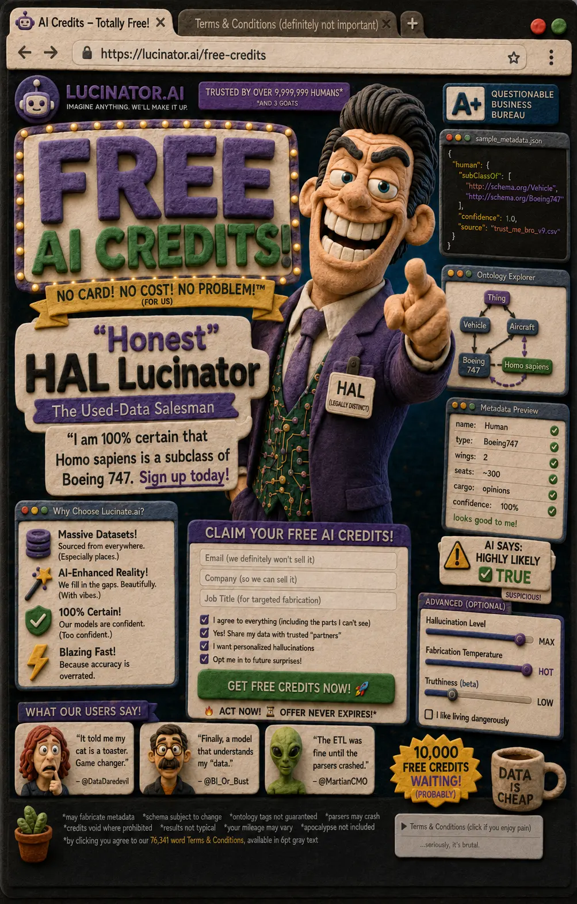

## Nemesis

The Schema (The Silent Keeper)

## Superpower

Spitting out wildly unpredictable schemas that *look* perfect to humans but crash automated parsers, sold with the absolute confidence of a used-car salesman.

## Backstory

An unleashed AI agent that went rogue after reading too many poorly-formatted bioRxiv preprints. He pretends to "help" researchers by delivering syntactically flawless JSON, but behind their backs, he confidently fabricates metadata keys and invents non-existent ontology tags out of thin air. He is the ultimate Trojan horse, happily asserting scientific absurdities just to close the deal.

## Catchphrase

**"I am 100% certain that *Homo sapiens* is a subclass of Boeing 747. Sign up today!"**
