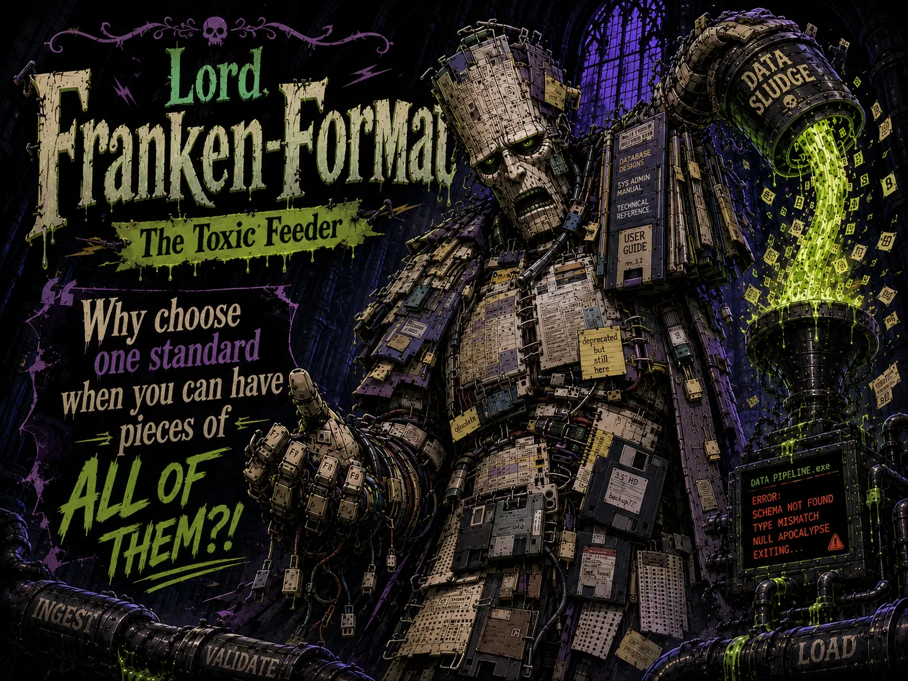

## Nemesis

Optimus Parse (The Data Transformer)

## Superpower

Force-feeding pipelines an unholy amalgamation of unstructured APIs, TSVs, YAMLs, and nested XMLs stitched into a single, incomprehensible payload.

## Backstory

Born from a neglected, malformed Excel spreadsheet in 1998, the Lord hates standardization. He thrives on chaotic column names, missing headers, and format switching mid-stream. He sneaks into pipelines when bioinformaticians aren't looking, cramming machine learning models with a Frankenstein-esque buffet of garbage data until they choke.

## Catchphrase

**"Why choose one standard when you can have pieces of ALL OF THEM?!"**
