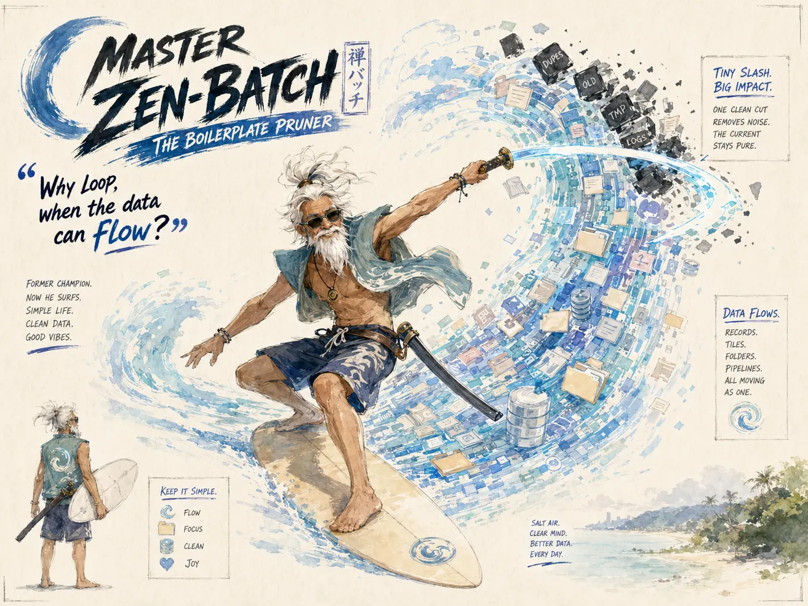

## Nemesis

Dr. Final_v3_Real / The Spaghetti Monster (The Jekyll & Hyde of Code)

## Superpower

Effortlessly mapping and processing thousands of hierarchical records simultaneously without ever writing a `for`-loop.

## Backstory

Once a martial arts champion, Master Zen-Batch now lives the simple life as a relaxed Australian data surfer. Barefoot, sun-weathered, and smiling behind dark sunglasses, he rides luminous waves of batch data where records, folders, tables, and pipelines all move as one current. With one tiny, lazy katana slash, he prunes boilerplate, duplicate logic, manual type-casting, and tangled iteration traps. He does almost nothing — and everything flows.

## Catchphrase
**"Why loop, when the data can flow?"**
