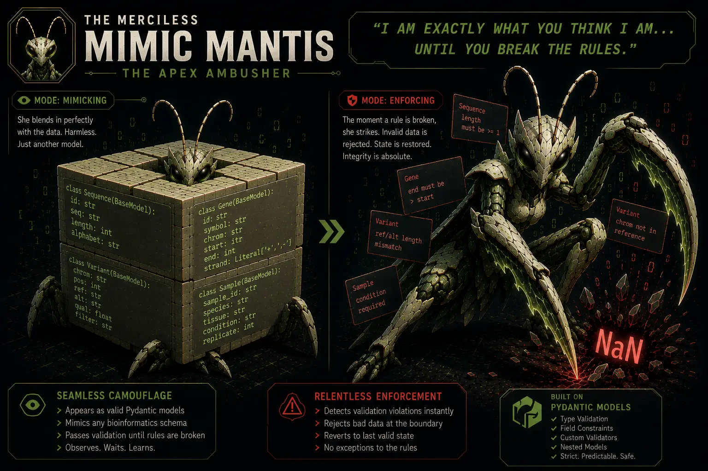

## Nemesis

The Null Ninja (The Silent Corruptor)

## Superpower

Absolute structural camouflage, internal surveillance, and lightning-fast state-reversion strikes.

## Backstory

Normally, data validation only happens at the entrance to a pipeline, giving the Null Ninja room to rot data from the inside. Built on advanced Python Protocols, The Merciless Mimic Mantis utilizes perfect structural camouflage, sitting completely motionless while adapting her appearance to look, act, and respond *exactly* like a harmless, standard Python `list` or `dict`. She stays embedded with the data during interactive manipulation. The exact microsecond the Ninja tries to coerce a `NaN` into an integer, she drops her camouflage, snaps her strict-type claws, and rolls the dataset back to its last safe state.

## Catchphrase
**"I am exactly what you think I am... until you break the rules."**
