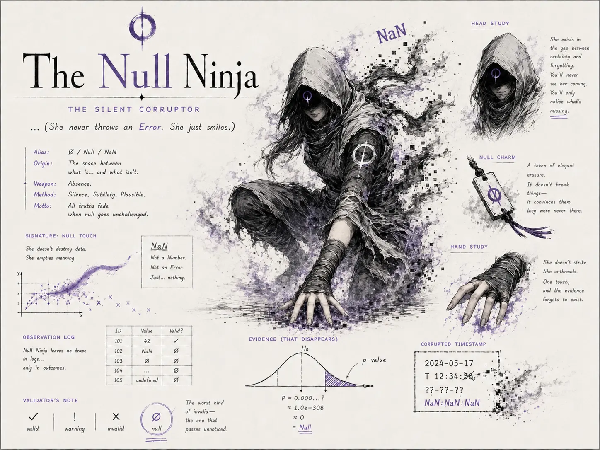

## Nemesis

The Merciless Mimic Mantis (The Apex Ambusher)

## Superpower

Silent erasure and null corruption. She bypasses standard validators to cast `NaN`s, `strings`, and malformed dates into plausible-looking integer sequences without throwing an error, then quietly unthreads the evidence so the corruption looks as if it was always there.

## Backstory

She lives in the gap between certainty and forgetting, haunting the shadows of "loose" validation scripts. Rather than crashing your pipeline today, the Null Ninja rots your flow from the inside out: p-values drift, timestamps become beautiful impossibilities, and logs remain spotless while outcomes quietly lose their meaning. By the time a postdoc notices something is wrong three months later, her physical form has already dissolved into pixel dust, violet smoke, and a perfectly reasonable-looking `NaN`.

## Catchphrase

**"... (She never throws an Error. She just smiles.)"**
