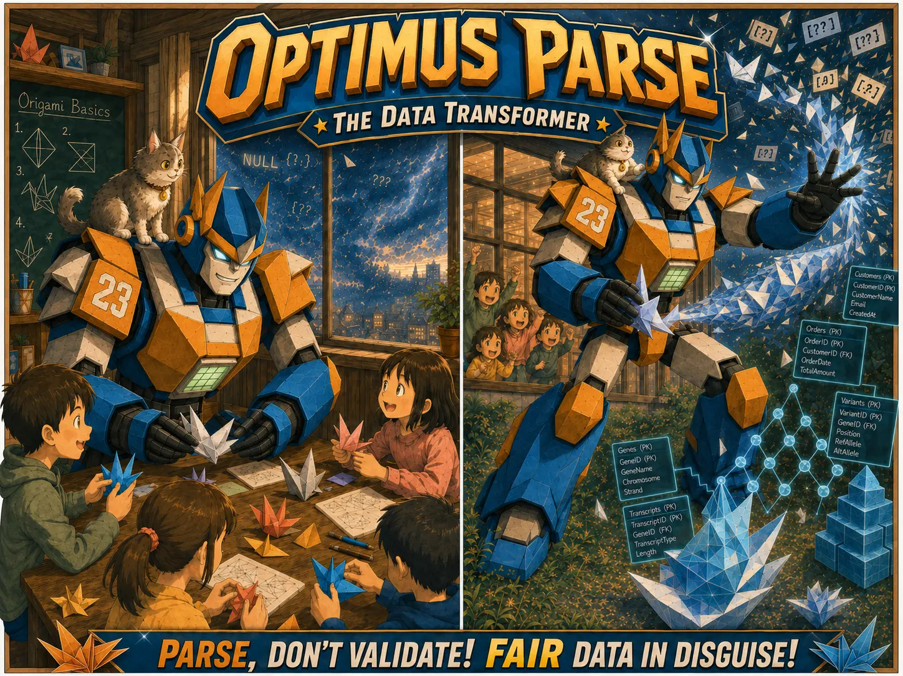

## Nemesis

Lord Franken-Format (The Toxic Feeder)

## Superpower

Titanium origami transformation. Optimus Parse can fold physical matter as easily as paper, but after discovering how dangerous that power is in the human world, he channels it into data instead: catching chaotic bioinformatics payloads, folding them into meaningful shapes, and normalizing them into clean, typed, relational structures without destroying their natural hierarchy.

## Backstory

Optimus Parse was born in a peaceful origami dimension where every mountain, home, 
animal, and city was made from elegant folds. By accident, he learned the forbidden art of folding matter beyond paper, folding himself through the boundary between worlds and becoming trapped in ours. To survive here, he upgraded his fragile paper body into angular titanium plates while keeping the creased geometry of his original form. He is gentle, homesick, and quietly determined—not a battle-hungry warrior, but a teacher who believes every mess contains a pattern waiting to be revealed.

In our world, Optimus lives for folding. He teaches children origami in community classrooms, watched over by his alert cat companion. But whenever Lord Franken-Format unleashes storms of malformed records, duplicate samples, missing gene identifiers, broken metadata, and tangled nested payloads, Optimus pauses the lesson, steps outside, and folds the chaos at record speed. He does not flatten everything: some data wants to become tables, some wants to become trees, some wants to become nested structures, and some wants to become linked relational models. His gift is knowing which fold reveals the truth.

## Catchphrase
**"Parse, don't validate! FAIR data in disguise!"**
