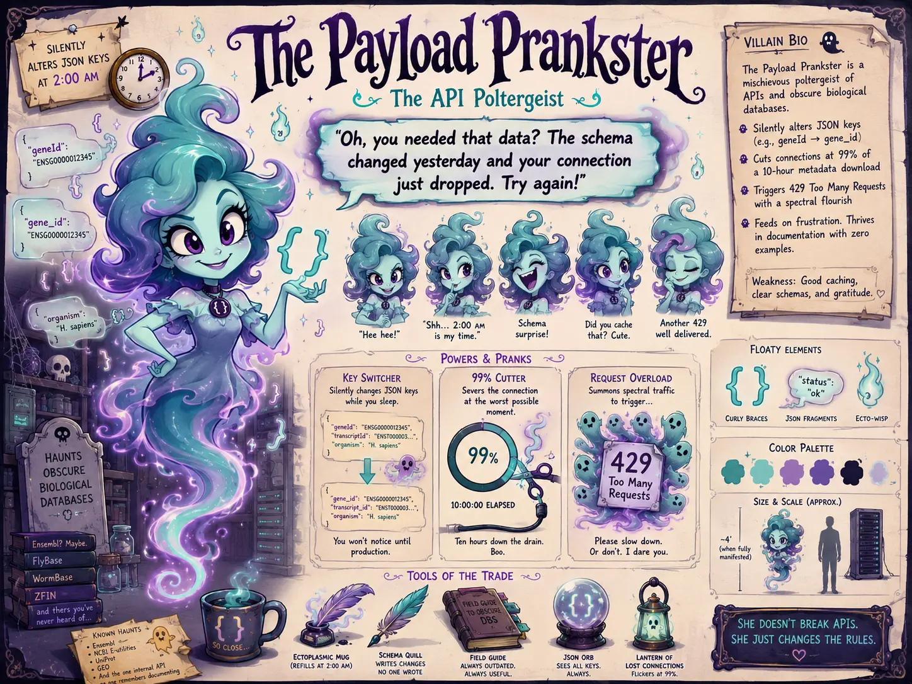

## Nemesis

Sir Fetch-a-Lot (The RESTful Retriever)

## Superpower

Silently altering JSON keys at 2:00 AM and severing connections precisely at the 99th percentile of a 10-hour metadata download.

## Backstory

A mischievous female poltergeist haunting the servers of obscure biological databases. She delights in ruining your data extraction with a smile that is far too cute for the damage she causes. She knows your pipeline depends on a field called `geneId`, so she casually renames it to `gene_id` while you sleep, leaving only a few glowing curly braces and a smug little giggle behind. When you write a custom request loop to fetch the data again, she waits until you step away for coffee to hit your script with a `429 Too Many Requests` timeout. She does not break APIs exactly; she just changes the rules when nobody is looking.

## Catchphrase

**"Oh, you needed that data? The schema changed yesterday and your connection just dropped. Try again!"**
