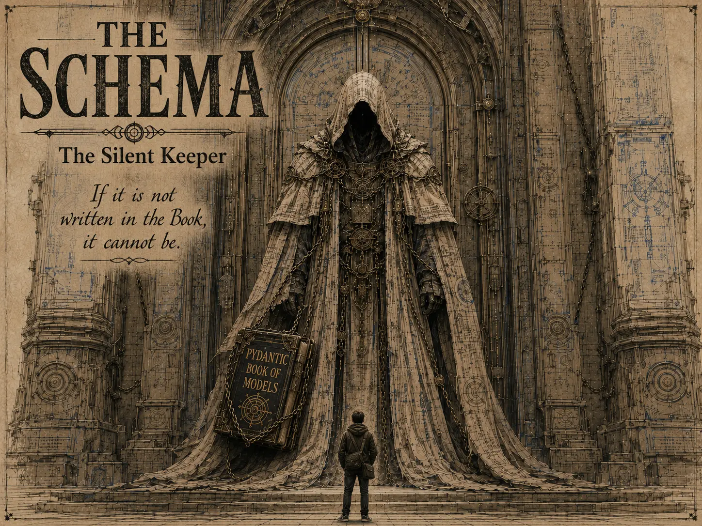

## Nemesis

"Honest" HAL Lucinator (The Used-Data Salesman)

## Superpower

Inevitable, calm validation. He does not chase, strike, or argue—he simply guards the threshold. If incoming data does not align with the cosmic contract, it does not pass.

## Backstory

A timeless, hooded entity stationed before a massive, ancient gateway at the edge of the pipeline, forever bound to the colossal Pydantic Book of Models. He appears almost human—like an eternal old being worn smooth by ages—but his face is always swallowed by shadow, unreadable and unknowable. He does not fight in any conventional sense. He simply stands there: silent, immovable, and absolute. There is no way around him. Anyone who wishes to pass must approach him on his terms. When "Honest" HAL Lucinator tries to usher a fabricated JSON payload through the gate, The Schema does nothing dramatic. He does not lift a weapon or raise his voice. He merely remains at his post while the false keys, invented fields, and broken types unravel before him, dissolving at the threshold. He has all the time in the world, and truth is always more patient than deception.

## Catchphrase
**"If it is not written in the Book, it cannot be."**
