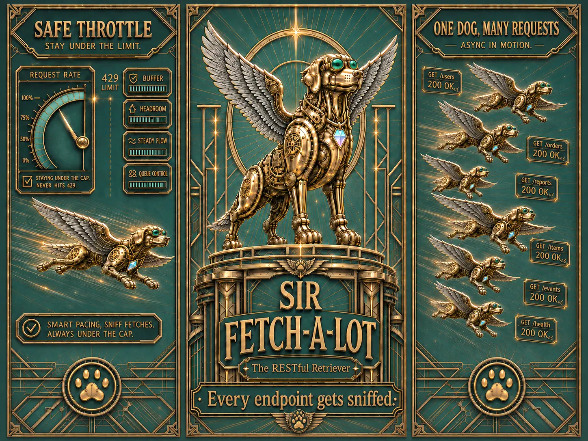

## Nemesis

The Payload Prankster (The API Poltergeist)

## Superpower

Blazing-fast API retrieval through smart request pacing, safe rate-limit control, parallel asynchronous fetching, and relentless pagination tracking.

## Backstory

A noble winged cyber-hound built to retrieve payloads from even the most labyrinthine APIs. Sir Fetch-a-Lot never carelessly slams into the rate limit—he runs at full speed while staying just under the cap. When data is scattered across multiple endpoints, he splits his attention across many fetch missions at once, gliding through requests in parallel. And when the response stretches across page after page, he follows every next trail with unwavering loyalty until the full result set is safely brought home. He is swift, disciplined, and unstoppable: the goodest boy of distributed retrieval.

## Catchphrase
**"Every endpoint gets sniffed."**
