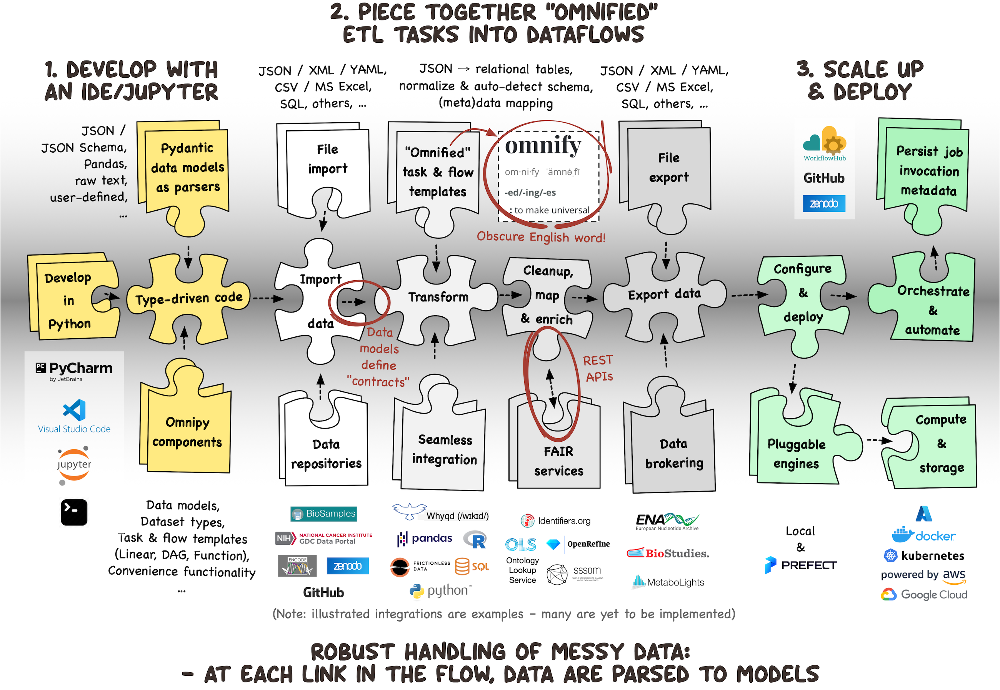

Omnipy is a type-driven Python library for:

- data parsing, wrangling, visualization, and conversion
- tool and web service interoperability, and
- scalable dataflow orchestration




## Why use Omnipy?

**Dataflows, Not Workflows**

Traditional workflows rely on command-line tools and intermediate files, adding complexity to data
pipelines. Omnipy replaces this with dataflows that operate directly in memory or on standard
formats like JSON or CSV. Built on [Pydantic](https://docs.pydantic.dev/) models, Omnipy enhances
data parsing, conversion, and serialization for structured data processing.

**"It's Static Typing!"… "It's Dynamic!"… "It's Omnipy!"**

Omnipy blends Python’s dynamic typing with runtime type safety. Models behave like native Python
structures while ensuring type guarantees without the rigidity of static typing. Defined in Python,
Omnipy models can be as general or specific as needed.

**Parse, Don’t Validate**

Strict validation often breaks pipelines when data is messy. Inspired by
["Parse, don't validate"](https://lexi-lambda.github.io/blog/2019/11/05/parse-don-t-validate/),
Omnipy eagerly parses input into structured models that retain integrity throughout the pipeline.
This approach aligns with the [Robustness Principle](https://devopedia.org/postel-s-law): _"be
liberal in what you accept, and conservative in what you send!"_

**Self-Constraining Data Models**

Omnipy models aren’t just one-time validators. A `Model[list[int]]()` behaves like a list but
ensures its elements are always integers. Every modification parses data to enforce integrity,
rolling back invalid operations automatically.

**Omnify Your Data Pipelines**

Omnipy invites you to ["omnify"](https://www.websters1913.com/words/Omnify) pipelines — break them
into reusable, universal components. By defining dataflows and tasks with structured input and
output models, Omnipy simplifies reuse and promotes good coding practices, improving maintainability
as projects grow.

**Catalog of Components for Interoperability**

Omnipy includes components for tasks like asynchronous API requests with rate limiting, parsing JSON
or tabular data, and flattening nested data into relational tables. Integration with REST APIs and
data wrangling/analysis tools like [Pandas](https://pandas.pydata.org/) simplifies interoperability
across diverse systems. Expect the catalog to grow as the community expands!

**Built to Scale**

Omnipy’s hierarchical `Dataset` structure simplifies batch processing of directory-based data,
including parsing, serialization, and metadata handling. With
built-in [Prefect](https://www.prefect.io/) support, Omnipy scales seamlessly from local experiments
to distributed deployment, meeting the demands of projects large and small.


## Installing Omnipy

1. Make sure that your Python version is between `3.10` and `3.13` (Python `3.14` is not yet 
   supported), e.g.:

    ```bash
    $ python --version
    Python 3.10.14
    ```

2. Create and activate a virtual environment for your project, e.g.:

    ```bash
    $ python -m venv myproject
    $ source myproject/bin/activate
    ```

    > TIP:
    > - If you need help with setting up a virtual environment, check out the relevant section in
    >   the [FastAPI documentation](https://fastapi.tiangolo.com/virtual-environments/).
    >   _(Please note that Omnipy does not depend on FastAPI, it is just that their documentation is 
    >   excellent!)_
    > - If you are using Omnipy in a [Jupyter notebook](https://jupyter.org/), you can most likely 
    >   skip this step. 

2. Install Omnipy using:
    ```bash
    $ pip install omnipy
    ```

## Getting started

To define an Omnipy data model, simply concretize the generic `Model` class by specifying a 
data type in brackets, e.g. `Model[list[int]]`.

The following creates a data model of a list of integers, and parses some data into that model:

```pycon exec="1" session="greet" source="console"
>>> from omnipy import Model
>>> data = (123, '234', 345.0)  # Note that the input data is a tuple of mixed types
>>> data_as_list_of_ints = Model[list[int]](data)
>>> data_as_list_of_ints  # The data is now parsed into a list of integers
```

```pycon exec="1" session="greet" result="console" html="true"
>>> print(data_as_list_of_ints._docs())
```
 
Omnipy Models are self-constraining, meaning that they will always ensure that the data 
they contain is of the correct type. For example, if you try to append a string to the 
list of integers, it will raise an error:

```pycon
>>> data_as_list_of_ints.append('abc')  # This will raise an error
```

```pycon exec="1" session="greet" result="console"
>>> try:
>>>     data_as_list_of_ints.append('abc')
>>> except Exception as err:
>>>     print(err)
```

Importantly, Omnipy models automatically reverts to snapshots after an error occurs, 
allowing you to retry the operation without having to re-parse the data, continuing
from where you left off. This is particularly useful when working with large dataflows,
as it allows you to handle errors gracefully without losing your progress.

```pycon exec="1" session="greet" source="console"
>>> data_as_list_of_ints
```

```pycon exec="1" session="greet" result="console" html="true"
>>> print(data_as_list_of_ints._docs())
```

```pycon exec="1" session="greet" source="console"
>>> data_as_list_of_ints.append('456')
>>> data_as_list_of_ints
```

```pycon exec="1" session="greet" result="console" html="true"
>>> print(data_as_list_of_ints._docs())
```

More to come soon...

## Running example scripts
- Install `omnipy-examples`:
  - `pip install omnipy-examples`
- Example script:
  - `omnipy-examples isajson`
- For help on the command line interface:
  - `omnipy-examples --help`
- For help on a particular example:
  - `omnipy-examples isajson --help`

### Output of flow runs

The output will by default appear in the `data` directory, with a timestamp. 

- It is recommended to install a file viewer that are capable of browsing tar.gz files. 
  For instance, the "File Expander" plugin in PyCharm is excellent for this.
- To unpack the compressed files of a run on the command line 
  (just make sure to replace the datetime string from this example):
  ```
  for f in $(ls data/2023_02_03-12_51_51/*.tar.gz); do mkdir ${f%.tar.gz}; tar xfzv $f -C ${f%.tar.gz}; done
  ```

### Run with the Prefect engine

Omnipy is integrated with the powerful [Prefect](https://prefect.io) dataflow orchestration library.

- To run an example using the `prefect` engine, e.g.:
  - `omnipy-examples --engine prefect isajson`
- After completion of some runs, you can check the flow logs and orchestration options in the Prefect UI:
  - `prefect server start`

More info on Prefect configuration will come soon.
